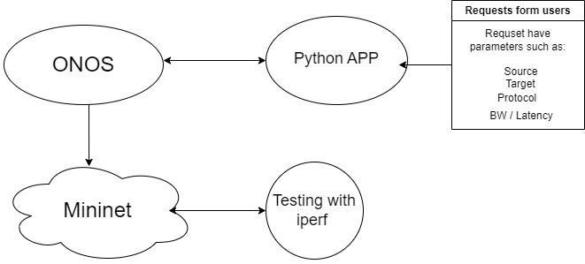

This Python script is engineered to manage and optimize network routing within a Mininet-simulated network landscape. By using RESTConf API provided by ONOS controller,
 the script ensures agile and efficient routing adjustments based on live network conditions, to maxisime efficenty of simulated environment using graph_operation.py that is an implementation of Djiksta algorythm changed to perform in network enviroment.

This project utilizes Mininet to construct a simulated network comprising various nodes and linkages that mirror an intricate network topology as delineated in inetmap.json. Integration with the ONOS controller via RESTConf APIs 
enables automated governance and oversight of network flows.

